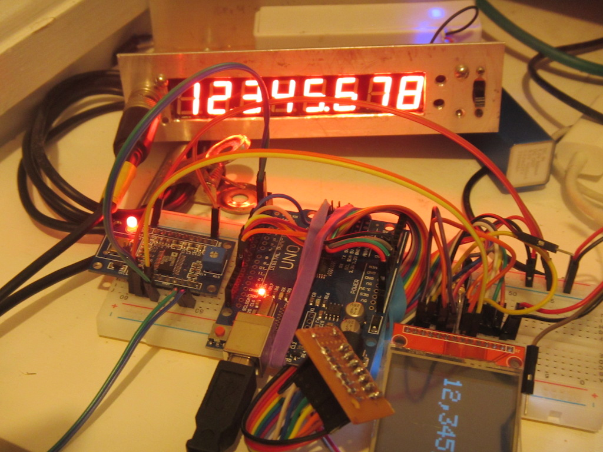

# Arduino Touchscreen AD9851 Direct Digital Synthesis Application

The AD9851 from Analog Devices does direct digital sythesis of radio frequency signals.
This application uses an Arduino UNO with a TJCTMP24024 LCD TFT Touchscreen to provide
a friendly RF signal generator.

Touch above or below each digit to increment or decrement (with auto-repeat),
or touch a digit and drag up or down to adjust it. Both operations carry to
the higher digits.

## Libraries

This application uses the standard Arduino SPI library, and the
Adafruit libraries for GFX and to drive the ILI9341 LCD display.

The TJCTMP24024 LCD has an XPT2046 touch-screen however, and I
have a custom fork of Paul Stoffregen's driver:

[XPT2046_Touchscreen](https://github.com/cjheath/XPT2046_Touchscreen)

The libraries for AD9851 and Touchscreen Events use C++ templates:

[AD9851](https://github.com/cjheath/AD9851)

[Touchscreen Event dispatcher](https://github.com/cjheath/TSEvents)
